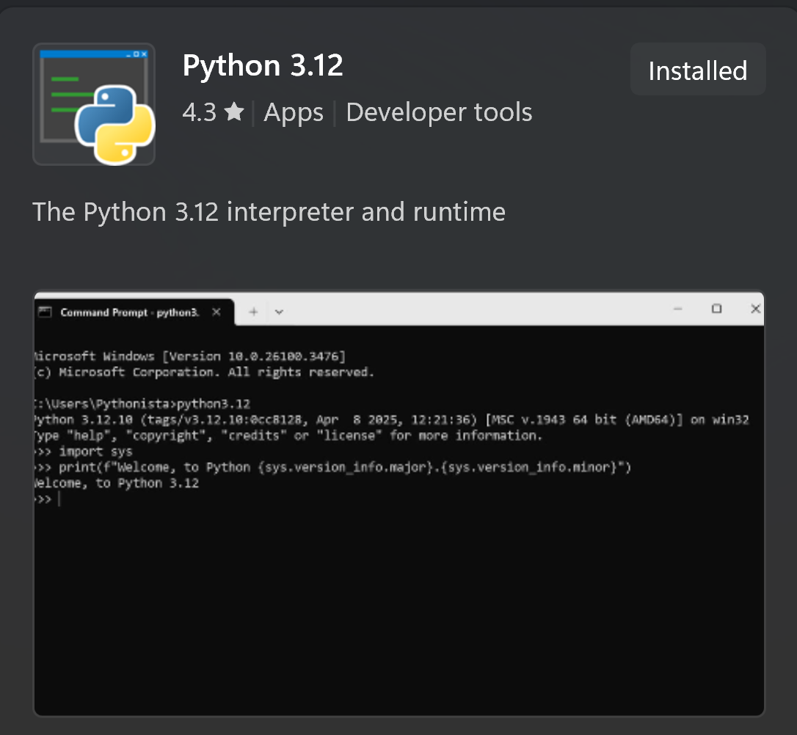
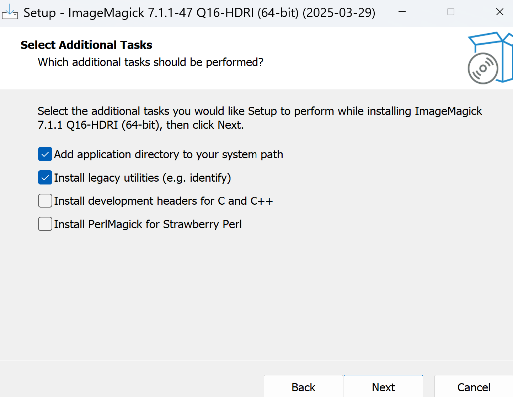
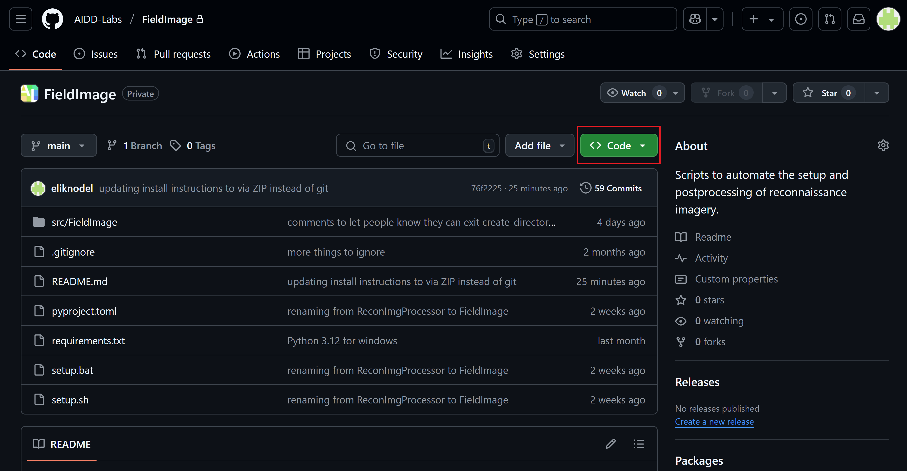
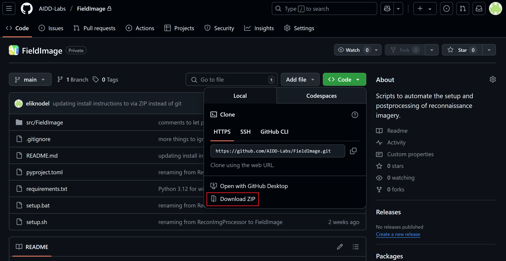
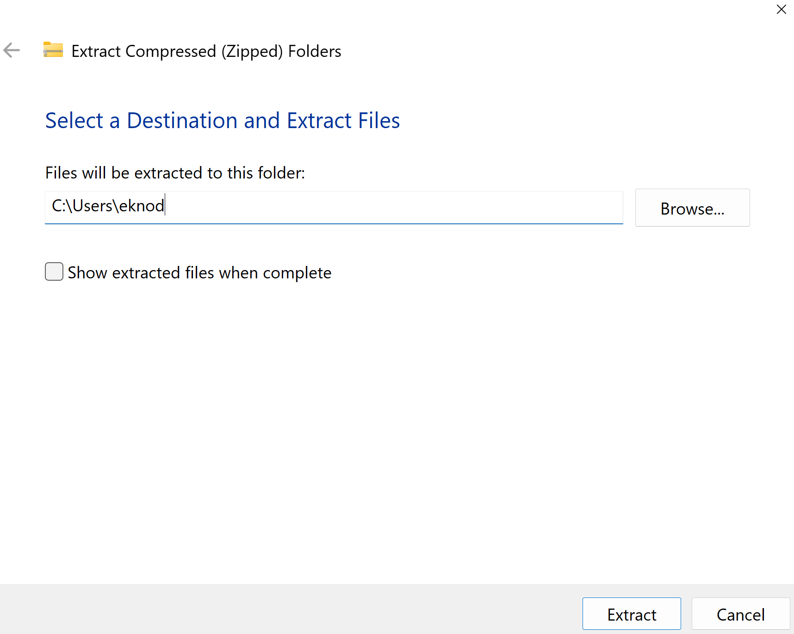

# FieldImage

FieldImage is a command-line tool that takes simply organized images and extracts their location information from existing metadata, outputting images in an organized file structure with a supporting image data table and map.

This Python-based tool has two different commands, `create-directory-sites` and `ipro-locator`. 
The command `create-directory-sites` starts an interactive program that helps you create an organized file structure for photo uploading.
After uploading photos, `ipro-locator` can be called to extract image location data, rename images, identify and delete similar images (optional), compress images (optional), and create a map of images.

FieldImage was developed in the Actionable Information for Disasters and Development (AIDD) Lab at the University of Michigan with support from the Earthquake Engineering Research Institute (EERI).

#### ⚠️ Important Note 🚨

Before taking images, make sure that your devices have location capabilities enabled. Not all cameras have a GNSS (Global Navigation Satellite System) receiver. 
If taking images on your phone, you can check that location services are enabled for the camera app in your settings. 

## Getting started

The setup instructions below require no prior interaction with the command line, and assume that you may not have Python or Git installed.
Following these instructions, FieldImage will be installed via a ZIP download.
If you prefer to install FieldImage using Git, follow the instructions in `README_git.md` (coming soon).
After working through these instructions, you will have FieldImage installed, giving you the `create-directory-sites` and `ipro-locator` commands that can be called from any directory on your computer (not just the directory the code is in).

### Helpful Commands

#### Windows

In Command Prompt, use `cd` (change directory) to navigate to directories.
For example if you are in `C:\Users\YourName`, you can navigate to `C:\Users\YourName\path\to\folder` through the following:

<pre>
cd path\to\folder
</pre>

You can run the `dir` (list files/directories) command to see what folders and files are in this directory.  

Here are some more potentially helpful commands for Command Prompt:
   - `cd ..` -> move up one directory
   - `cd ..\..` -> move up two directories
   - `cd %HOMEPATH%` -> change to your home directory
   - `mkdir directory_name` -> create directory named 'directory_name' in current directory
   - `rmdir directory_name` -> delete **empty** directory named 'directory_name'

#### Mac / Linux / WSL

In the Terminal, use `cd` (change directory) to navigate to directories.
For example if you are in your home directory `~`, you can navigate to `path/to/folder` through the following:

<pre>
cd path/to/folder
</pre>

You can run the `ls` (list files/directories) command to see what folders and files are in this directory.  

Here are some more potentially helpful commands for the Terminal:
   - `cd ..` -> move up one directory
   - `cd ../..` -> move up two directories
   - `cd ~` -> change to your home directory
   - `pwd` -> print current working directory
   - `mkdir directory_name` -> create directory named 'directory_name' in current directory
   - `rmdir directory_name` -> delete **empty** directory named 'directory_name'

### 1. Install Python (if not already installed)

⚠️ Note: This software requires the use of Python 3.12.
To ensure that the install goes smoothly, please install this version.

Make sure to follow the instructions for your operating system (Windows / Mac / Linux / WSL).

#### Windows Instructions

To check if you already have Python installed, open the Command Prompt and run this command:

<pre>
python3 --version
</pre>

If Python is installed, its version will be printed (`Python 3.XX.X`). 
Otherwise, it will print something stating that it does not recognize 'python' as a command.

If your version of Python is greater than `Python 3.12`, **please uninstall your version** and installing `Python 3.12`.
At the time of writing this, some Python packages had not yet supported `Python 3.13` fully.
If you run into an error when installing FieldImage, this may be the cause.

If you need to install Python, go to the Microsoft Store and search for Python. 
You should see several versions of Python available — choose `Python 3.12`.

Click "Get" to install Python.
Once Python is installed, open the Command Prompt and run `python --version` again.
Now, you should see the version installed, and you're good to go!

#### Mac Instructions

##### Install Homebrew (if not already installed)

Open the Terminal app and run the following command to see if you already have Homebrew installed:

<pre>
brew --version
</pre>

If Homebrew is installed, this command should return something like `Homebrew 4.X.X`.
If instead it says `command not found`, paste the following into the Terminal to install Homebrew (this may take a few minutes): 

<pre>
/bin/bash -c "$(curl -fsSL https://raw.githubusercontent.com/Homebrew/install/HEAD/install.sh)"
</pre>

##### Install Python

To check if you already have Python installed, run this command in Terminal:

<pre>
python3 --version
</pre>

If it is installed, this command should return `Python 3.X` or something similar.
Otherwise, run this command in Terminal to install Python:

<pre>
brew install python@3.12
</pre>

You can verify that Python was installed by running `python3 --version` again.

#### Linux / WSL Instructions

WSL = Windows Subsystem for Linux

If you already have WSL installed on your Windows computer, feel free to follow these instructions. 
Otherwise, the general Windows instructions are likely more straightforward.

Whether you are using WSL or a Linux operating system, you can check if Python and pip are installed by running the following in the terminal:

<pre>
python3 --version
pip3 --version
</pre>

Based on the results of these commands, you can install Python and/or pip by following these commands:

<pre>
sudo apt update                                    # updates package lists
sudo apt install -y software-properties-common     # install tools and add repositories
sudo add-apt-repository -y ppa:deadsnakes/ppa      # allows you to install newer Python versions
sudo apt update                                    # updates package lists again
sudo apt install -y python3.12                     # installs Python 3.12
python3.12 -m ensurepip --upgrade                  # ensures that pip installed
python3.12 -m pip install --upgrade pip            # upgrades pip to latest version
</pre>

After installing, you can verify that you now have both Python and pip using `python3 --version` and `pip3 --version`, respectively.

### 2. Install ImageMagick

ImageMagick is an open-source software used in FieldImage to edit images.
Make sure to follow the instructions for your operating system.

#### Windows Instructions

To install ImageMagick, follow these steps:  

a. Go to: https://imagemagick.org/script/download.php#windows  
b. Download the recommended version for 64-bit Windows (important: not the static or portable ones)  
c. Run the installer with the following settings selected:
   - Add application directory to your system path
   - Install legacy utilities

d. Once the installer has finished, close and reopen Command Prompt  
e. Verify that ImageMagick has installed by running `magick --version` in the Command Prompt. You should see something like `Version: ImageMagick 7.1.1-XX Q16 x64  [etc...]`  

Now, you are ready to install FieldImage!

#### Mac Instructions

In the Terminal, run the following command using Homebrew:

<pre>
brew install imagemagick
</pre>

You can verify that ImageMagick was installed by running:

<pre>
magick --version
</pre>

Now, you are ready to install FieldImage!

#### Linux / WSL Instructions

In the Terminal, run the following commands:

<pre>
sudo apt update                  # updates package lists
sudo apt install imagemagick     # installs ImageMagick
</pre>

You can verify that ImageMagick was installed by running:

<pre>
convert --version
</pre>

Now, you are ready to install FieldImage!

### 3. Download FieldImage

In the [FieldImage GitHub](https://github.com/AIDD-Labs/FieldImage), click the green `<> Code` dropdown button and select `Download ZIP`.

The ZIP will likely be named `FieldImage-main`, indicating that the `main` branch of the code has been downloaded.

#### Windows / Mac Instructions

Extract the contents of the ZIP file in a location that makes sense for you. In this example, I extract the contents to my home folder:

Remember where you extract the folder, as you will need to navigate to it using the command line.

#### Linux / WSL Instructions

Extract the contents of the ZIP file in a location that makes sense for you, following this structure:

<pre>
sudo apt install unzip                    # install the unzip command to extract from ZIP files
cd path/to/extract_location               # change to directory that you want to extract FieldImage
unzip path/to/FieldImage-main.zip -d .    # extract in current directory
</pre>

### 4. Install FieldImage

With the source code for FieldImage downloaded and extracted onto your computer, we will use the command line to install the software.
Feel free to refer to the [Helpful Commands](#helpful-commands) for navigating in the command line for your operating system.

#### Windows Instructions

Open the Command Prompt and navigate to the `FieldImage-main` directory using `cd`.
Then, run the following to create a virtual environment and install the software to your computer in this environment:

<pre>
.\setup.bat                         # setup file that creates virtual environment and installs FieldImage  
call .venv\Scripts\activate.bat     # activates virtual environment
</pre>

Running `setup.bat` may take a few minutes.
Once it finishes, you can run the following command, showing the help menu for the `ipro-locator` command, verifying that everything has been installed appropriately:

<pre>
ipro-locator -h
</pre>

This is the end of the setup!

#### Mac / Linux / WSL Instructions

Open the Terminal and navigate to the `FieldImage-main` directory using `cd`.
Then, run the following to create a virtual environment and install the software to your computer in this environment:

<pre>
./setup.sh                      # setup file that creates virtual environment and installs FieldImage  
source .venv/bin/activate       # activates virtual environment
</pre>

Running `setup.sh` may take a few minutes.
Once it finishes, you can run the following command, showing the help menu for the `ipro-locator` command, verifying that everything has been installed appropriately:

<pre>
ipro-locator -h
</pre>

This is the end of the setup!

### 5. ⚠️ Important Note 🚨

If you close and reopen the command line, **you may no longer be in the virtual environment** (often indicated by `venv` to the left of the directory).

#### Windows Instructions

To reenter the virtual environment and gain access to FieldImage's commands, **run this in the `FieldImage-main` directory**:

<pre>
call .venv\Scripts\activate.bat
</pre>

You can run `echo %VIRTUAL_ENV%` to check if the virtual environment is active.
If you want to exit the virtual environment, enter and run `deactivate`.

#### Mac / Linux / WSL Instructions

To reenter the virtual environment and gain access to FieldImage's commands, **run this in the `FieldImage-main` directory**:

<pre>
source .venv/bin/activate
</pre>

You can run `echo $VIRTUAL_ENV` to check if the virtual environment is active.
If you want to exit the virtual environment, enter and run `deactivate`.

## Input data

To have site information associated with images, the input image directory must resemble the following file hierarchy, which can be created using the `create-directory-sites` command:

<pre>
├── YYYY-MM-DD
│   ├── site_1
│   │   ├── photographer_1
│   │   │   ├── 🖼️
│   │   │   ├── 🖼️
│   │   │   ├── …
│   │   ├── photographer_2
│   │   │   ├── 🖼️
│   ├── site_2
│   │   ├── photographer_1
│   │   │   ├── 🖼️
│   │   ├── photographer_2
│   │   │   ├── 🖼️
├── YYYY-MM-DD
│   ├── site_3
│   │   ├── photographer_1
│   │   ├── photographer_2
├── site_1.yaml
        site-name: site_1
        city: city_1
        attribute_1: attribute information
        attribute_2: attribute information
        attribute_n: attribute information
├── site_2.yaml
├── site_3.yaml
</pre>

Here, images are sorted by date, site, and photographer, making it easy for photographers to upload images into a shared folder.
In addition, each site has an associated `.yaml` file containing site-specific information.
When the input image directory is structured in this way, site information can be assigned to all uploaded images.

If your data is unstructured, or follows a different hierarchy that you prefer, that is perfectly fine.
When processing images using `ipro-locator`, a new directory will be created following your inputted file structure.
However, any site information included in the directory will not be recognized.

### Running create-directory-sites:

If you are revisiting these instructions after downloading the code some time ago, there may be new changes to the software.
You can view the commit history in GitHub to see if this is the case.
If so, it is recommended that you download and reinstall FieldImage beginning at [Step 3](#3-download-fieldimage).

The `create-directory-sites` command is interactive.
It will gather information on the dates of image collection, sites visited, and photographers, and ask that you are prepared with all this information before you start.
Since this information may only become available shortly before data collection, the program can be run multiple times—before or after data collection—to update or complete the folder structure.
Upon running the program, a directory will be created (or added to) following the file hierarchy shown above.
You can copy this directory into some sort of shared drive to allow for easy image uploading.

If you make any typos while in the `create-directory-sites` program, you may enter `exit` at any time to quit.

To run this interactive program, simply run:

<pre>
create-directory-sites
</pre>

After running `create-directory-sites` you are welcome to manually create new date, site, and photographer folders following the same structure.
Similarly, you can modify the  `site.yaml` files, adding more site information as it becomes available.

⚠️ Note: Before taking images, make sure that your devices have location capabilities enabled. Not all cameras have a GNSS (Global Navigation Satellite System) receiver. If taking images on your phone, you can check that location services are enabled for the camera app in your settings. 

Make sure to upload images into the correct folders! Once the images are uploaded, you are ready to run `ipro-locator`.

## Running ipro-locator

If you are revisiting these instructions after downloading the code some time ago, there may be new changes to the software.
You can view the commit history in GitHub to see if this is the case.
If so, it is recommended that you download and reinstall FieldImage beginning at [Step 3](#3-download-fieldimage).

The `ipro-locator` tool takes an input image directory and extracts image time and location data, gives output images intuitive names based on their metadata, and creates an image data table that organizes and stores this metadata.
In addition, it creates an interactive map in which images and their locations and metadata can be viewed.
Output images are all converted to the JPEG file format. 
If your input image directory follows the hierarchy created by `create-directory-sites`, use the `-s` flag to create an output image directory that files images by city and incorporates site information included in the `site.yaml` files into the image data table. Using the `-s` flag, site and photographer information will also be included in the output image filenames.
If your input image directory follows a different hierarchy, the output image directory will be created under the same hierarchy as the input.
Regardless of the structure of your input image directory, if you would like to delete similar images, or if you have a maximum data threshold that needs to be met, please indicate that using their associated flags (`-d` and `-m`).

### Arguments

The only required arguments for `ipro-locator` are the input directory and the name of the output directory you'd like to create. Using the `-h` flag in the command line will show the available options below:

<pre>
Usage: ipro-locator [-h] -i INPUT_DIRECTORY -o OUTPUT_DIRECTORY [-s] [-d [DELETE_SIMILAR]] [-m MAX_SIZE]

Options:
  -h, --help            show this help message and exit
  -i INPUT_DIRECTORY, --input-directory INPUT_DIRECTORY
                        Path to the directory containing images
  -o OUTPUT_DIRECTORY, --output-directory OUTPUT_DIRECTORY
                        Path for the output directory to be created
  -s, --sites           If your directory was created using 'createDirectorySites.py', this
                        enables the inclusion of site information in the spreadsheet and image
                        names. Please make sure that the 'city' category is included in each of
                        your site.yaml files.
  -d [DELETE_SIMILAR], --delete-similar [DELETE_SIMILAR]
                        Deletes one of a pair of images in the new directory if they are
                        determined to be similar based on your inputted threshold value. If no
                        threshold value is entered, the recommended threshold of 0.94 will be
                        used. Valid threshold values are between 0 (not similar) and 1
                        (identical). Information related to how the similar images are handled
                        will be located in a folder called '_SIMILAR_IMAGES'
  -m MAX_SIZE, --max-size MAX_SIZE
                        If the sum of the data for all of the images needs to be below some
                        threshold, enter it here in GB. Images of large sizes in the new directory
                        will be optimally reduced to be below that threshold.
</pre>

### Example call

<pre>
ipro-locator -i ../structured-data -o ../structured-data-processed -s -d -m 2
</pre>

Here, all available options are used. The input directory is  `../structured-data` and the output directory to be created is `../structured-data-processed`. Additionally, the input directory was created using `create-directory-sites`, so the `-s` flag is used. In this command, there was also a choice to delete similar images `-d` using the default threshold of 0.94, and it was indicated that there is a maximum data threshold of 2 GB.

Below is the output for this call:

<pre>
✅ Directory follows appropriate structure to include site and photographer information.

Creating initial spreadsheet...
✅

Extracting time and location data...
Extracting metadata from image 562/562
✅

Creating output directory with renamed images...
Copying image 562/562
✅

Preparing to identify and delete similar images...
Getting feature vector for image 562/562
Comparing images 561 and 562

Found 30 pairs of similar images.
Deleting 22 images...
✅

Getting image sizes and preparing to compress...
Images larger than 4.39 MB will be compressed.
Compressing image 196/196
✅

Creating image map...
✅

✅ Created directory ../structured-data-processed of size: 1.91 GB
✅ Created spreadsheet: ../structured-data-processed/_IMAGE_METADATA/image_metadata.xlsx
</pre>

### Output image directory

If the all optional flags (`-s`, `-d`, and `-m`) are used, the output image directory will have a hierarchy similar to below. 

<pre>
├── _IMAGE_METADATA
│   ├── image_metadata.xlsx
│   ├── image_metadata.csv
│   ├── site_data.xlsx
├── _IMAGE_SIZE_DISTRIBUTIONS
│   ├── pre_compress_size_distribution.svg
│   ├── post_compress_size_distribution.svg
├── _SIMILAR_IMAGES
│   ├── similarity_delete_table.xlsx
│   ├── similar_images_different_sites.xlsx
│   ├── verify_site_ids.xlsx
├── city_1
│   ├── 🖼️
│   ├── 🖼️
│   ├── …
├── city_2
│   ├── 🖼️
├── city_3
│   ├── 🖼️
├── image_map.html
</pre>

The `_IMAGE_METADATA` folder holds the image data tables. 
Identical excel and csv spreadsheets are created named `image_metadata`.
Below are notes on some of the image data table columns:
   - `latitude`: camera latitude
   - `longitude`: camera longitude
   - `altitude-m`: camera altitude in meters
   - `direction-deg`: compass direction in degrees that the camera was facing at the time of the image
   - `latitude-reference`: reference point for `latitude` measurement (N = North)
   - `longitude-reference`: reference point for `longitude` measurement (E = East)
   - `altitude-m-reference`: reference point for `altitude-m` measurement
   - `direction-deg-reference`: reference point for `direction-deg` measurement (T = True north, M = Magnetic north)
   - `similar-image-deleted`: `TRUE` if a similar image to the one in that row was deleted, `FALSE` otherwise. Only present if `-d` flag is used.

If the `-s` flag is used, there will also be a `site_data.xlsx` file in the `_IMAGE_METADATA` folder. 
This table holds the attributes corresponding to each site (which are also present in `image_metadata` but included here for easy viewing).

If the `-m` flag is used, the `_IMAGE_SIZE_DISTRIBUTIONS` folder is created.
This folder holds histograms visualizing the size distribution of images before and after image compression.

If the `-d` flag is used, the `_SIMILAR_IMAGES` folder is created.
In this folder, there is the `similarity_delete_table.xlsx` spreadsheet that provides the input images that were determined to be similar, as well as which of the images were deleted in the output image directory.
If the `-s` flag is used, there may also be a `similar_images_different_sites.xlsx ` spreadsheet present. 
If this exists, it means there were images determined to be similar that were assigned different sites. 
In this case, neither output image is deleted, and it is up to the user to determine what to do with these images.
If the `verify_site_ids.xlsx` spreadsheet is present, output images in that table were determined to be similar to an image of a different site, but the image they are similar to has already been deleted (because it was similar to other images in its site).
This exists to allow users to check if these images were correctly assigned their sites.

⚠️ Note: Image hyperlinks in spreadsheets (for spreadsheets in the `_IMAGE_METADATA` and `_SIMILAR_IMAGES` folders) will only work on `.xlsx` files (not `.csv`), and **they may not work on all operating systems due to security permissions**.

The remaining folders store the actual images.
If the `-s` flag was used, images are filed by their associated cities.
Otherwise, images are filed in a structure identical to the input file structure.

The final file, `image_map.html`, is an interactive map. 
If you click on the image icons, a popup will appear with the image at that location and its metadata.
You can right-click the image and open it in a new tab if you would like to see it enlarged.
All image metadata present in the image data tables is included in these popups.

#### Images from which similar images were deleted

If you choose to delete similar images (`-d`), you may want to know which images had their similar duplicates deleted.
The image data tables in the `_IMAGE_METADATA` folder include a boolean column called `similar-image-deleted`, where `TRUE` indicates that a similar image to the one in that row was deleted.
For an image where `similar-image-deleted` is set to `TRUE` (kept image), you can determine the deleted similar image through the following steps:
   - Open one of the image data tables in the `_IMAGE_METADATA` folder.
   - Using the `input-image-folder` and `input-image-name` columns, find the kept image's input folder and name.
   - Open the `similarity_delete_table.xlsx` in the `_SIMILAR_IMAGES` folder.
   - Use `Ctrl + F` (`Cmd + F` on Mac) to search for the kept image's `input-image-name` in `similarity_delete_table.xlsx`. It will be located in either the `input-image-1-name` or `input-image-2-name` column and referred to as `image-1` or `image-2`, respectively. The kept image's `input-image-name` will also appear in the image's corresponding `link` column.
        - You can verify that you have found the kept image by comparing the image's corresponding input folder to the kept image's `input-image-folder`.
   - The opposite image in this row (`image-2` if the kept image is `image-1`) is the image that was deleted, as reported by the `output-image-deleted` column
   - Both `image-1` and `image-2` have associated link columns, allowing you to open and compare the similar images.

If you decide that you did not want one or more of the deleted images to have been removed, you can rerun `ipro-locator` under a greater threshold for `-d` or without the `-d` flag.
To find the previously deleted image that will now be included in the output image data table, note the deleted image's `input-image-name` and search for it in the new image data table.

## Getting help

Any questions about FieldImage can be directed to its author:

Eli Knodel (knodel@umich.edu)